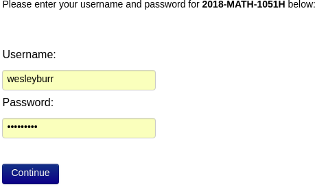
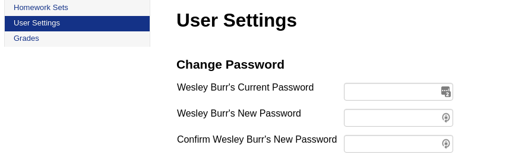
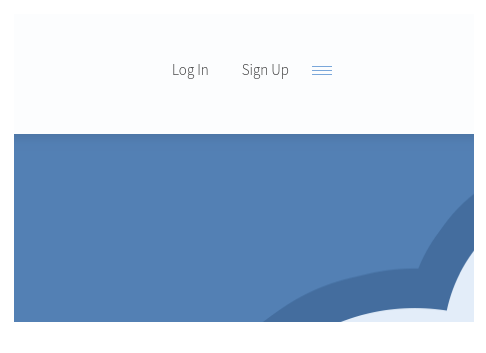

class: inverse

```{r include=FALSE}
library(ggplot2)
filter <- dplyr::filter
knitr::opts_chunk$set(warning=FALSE, message=FALSE, fig.width=10.5, fig.height=4, 
  comment=NA, rows.print=16)
theme_set(theme_gray(base_size = 24))
```

## Step 0: WiFi Connection

* there are two WiFi networks across the Trent campus
    - Eduroam (secure, requires password, ok speed)
    - Trent Guest (insecure, no password, HORRIBLE)
* we need to get all your laptops (and phones!) onto Eduroam

---

class: inverse

## Step 0: WiFi Connection

1. Put your phones in Airplane mode
2. Go to https://cat.eduroam.org/
3. Download the configuration tool
4. Install it

---

<center>

</center>

---

<center>

</center>

---

class: inverse

## Step 1: Logging into WeBWorK

* WeBWorK (or WW for short) is an online digital homework and grading system
* We'll be using it for some of your assignments this year
* URL: http://webwork.trentu.ca/webwork2/

---

class: inverse

## Step 1: Username and Password

* your username is your Trent ID (e.g., "wesleyburr" or "johnsmith")
* The default password has been set to your **student number** (without the 0)
    - eg., 601234
* go and login now!

---

<center>

</center>

---

<center>

</center>

---

class: inverse

## Step 1: Change your Password!

* save the URL http://webwork.trentu.ca/webwork2/ in your **bookmarks**
* **change your password** to something you know - don't forget what you change it to!

<br>
<center>

</center>

---

class: inverse

## Step 1: Assignment 0

* we've put an Assignment 0 up for everyone to try
* it doesn't count for grades
* the problems are really simple and easy (high school!)
* play with it, get used to the interface, figure out how to put in answers numerically

---

class: inverse

## Step 2: Slack

* instead of email, we're going to use **Slack** for class communication
* email is only for emergencies or personal (sensitive) communication
* the TAs and Professors will hold digital office hours using the platform
* another website!

---


class: inverse

## Step 2: Slack - URL

Go to the URL http://bit.ly/TrentU-Math-Slack and **register**.

* use your Trent email (e.g., wesleyburr@trentu.ca)
* don't save this URL: it's a one-time link to get you registered
* do it now!

---

<center>

</center>

---

<center>

</center>

---

<center>

</center>

---

class: inverse

## Step 3: RStudio

R is a **programming language for Statistics**. It lets us do a tremendous amount of very powerful work, and we're going to be using it in this class.

---

class: inverse

## Step 3: RStudio - Two Options

* download it for your personal computer (ok if you're comfortable with installing software)
    - advantages: more powerful, faster, no need for network connection
    - disadvantages: takes a bit more computer know-how, sometimes has issues with your specific computer
* use a version in the **cloud** (http://rstudio.cloud)
    - advantages: doesn't take much know-how, works on any computer
    - disadvantages: bit slower, advanced features sometimes not available, requires network connection

---

class: inverse

## Step 3: RStudio Cloud

To use the cloud version (the suggestion option):
* go to http://rstudio.cloud/
* create an account
* login!

---

## Top Right of Screen

<center>

</center>

---

## Use your Trent Email!

<center>

</center>

---

class: inverse

## Step 3: RStudio - On your Laptop

We've created a couple of installation videos for you to follow along with:
* http://bit.ly/MATH1051-Videos
    - Mac: https://www.youtube.com/watch?v=NDItU22Gry0
    - Windows: https://www.youtube.com/watch?v=mGxZ1geGHW8 (last half only)
* you can come to office hours for help, or ask on Slack
* mostly for people who are comfortable installing software and want to use the full-powered version
