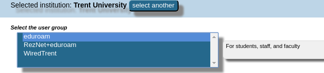
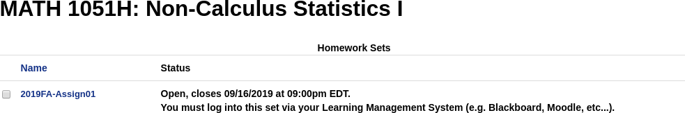
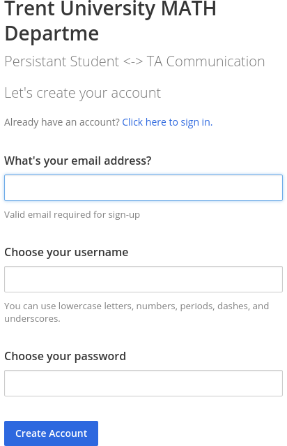

class: inverse

```{r include=FALSE}
library(ggplot2)
filter <- dplyr::filter
knitr::opts_chunk$set(warning=FALSE, message=FALSE, fig.width=10.5, fig.height=4, 
  comment=NA, rows.print=16)
theme_set(theme_gray(base_size = 24))
```

## Step 0: WiFi Connection

* there is one major WiFi network across the Trent campus
    - Eduroam (secure, requires password, ok speed)
* we need to get all your laptops (and phones!) onto Eduroam, or you have no WiFi ...

---

class: inverse

## Step 0: WiFi Connection

1. Put your phones in Airplane mode (router gets overwhelmed!)
2. Go to https://cat.eduroam.org/
3. Download the configuration tool
4. Install it

<br />

**OR**

1. Go to http://my.trentu.ca/portal/
2. Click on Services
3. Click on IT Services (left side)
4. Connect to WiFi

---

<center>

</center>

---

<center>

</center>

---

class: inverse

## Step 1: WeBWorK

* WeBWorK (or WW for short) is an online digital homework and grading system
* We'll be using it for some of your assignments this year
* To connect, use the link in Blackboard (so it auto-logs you in!)
* http://learn.trentu.ca/ -> login to Blackboard -> go to our course -> left hand side
* **Do not bookmark WW - you have to go back through Blackboard every time**

---

<center>

</center>

---

class: inverse

## Assignment 1

* we've put an Assignment 1 up for everyone to get started on 
* infinite attempts!
* play with it, get used to the interface
* all questions are vocab / definitions from the first chapter of our textbook

---

class: inverse

## Step 2: Our Chat System (called 'Mattermost')

* signup link in the announcements on Blackboard
* go there now if you haven't already, and click the link
* use your Trent email (e.g., wesleyburr@trentu.ca)
* don't save this URL: it's a one-time link to get you registered
* do it now!

---

<center>

</center>

---

class: inverse

## Step 3: RStudio

R is a **programming language for Statistics**. It lets us do a tremendous amount of very powerful work, and we're going to be using it in this class.

---

class: inverse

## Step 3: RStudio - Two Options

* download it for your personal computer (ok if you're comfortable with installing software)
    - advantages: more powerful, faster, no need for network connection
    - disadvantages: takes a bit more computer know-how, sometimes has issues with your specific computer
* use a version in the **cloud** (http://rstudio.cloud)
    - advantages: doesn't take much know-how, works on any computer
    - disadvantages: bit slower, advanced features sometimes not available, requires network connection

---

class: inverse

## Step 3: RStudio Cloud

To use the cloud version (the suggestion option):
* go back to Blackboard
* click the invite link in the announcement
* create an account
* login!

---

## Use your Trent Email!

<center>

</center>

---

class: inverse

## Step 3: RStudio - On your Laptop

We've created a couple of installation videos for you to follow along with:
* http://bit.ly/MATH1051-Videos
    - Mac: https://www.youtube.com/watch?v=NDItU22Gry0
    - Windows: https://www.youtube.com/watch?v=mGxZ1geGHW8 (last half only)
* you can come to student hours for help, or ask on Mattermost
* mostly for people who are comfortable installing software and want to use the full-powered version

---

class: inverse

## Step 4: Playing in RStudio

In RStudio's cloud, there are two workshops already visible to you: one is for this week.
The TAs are now going to step you through making your own copy of the workshop, and creating
a blank document. 

We're going to do all of our work in this **new** interface, so let's take
a few minutes to play around and figure out where all the buttons are ...