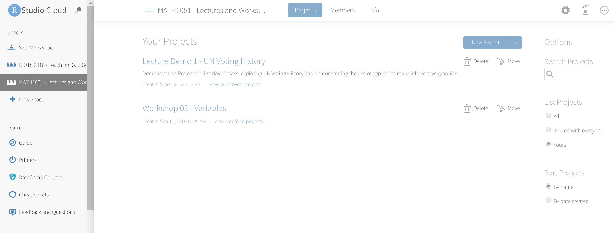

class: inverse

```{r include=FALSE}
library(ggplot2)
filter <- dplyr::filter
knitr::opts_chunk$set(warning=FALSE, message=FALSE, fig.width=10.5, fig.height=4, 
  comment=NA, rows.print=16)
theme_set(theme_gray(base_size = 24))
```

## Step 0: Class Workspace on rstudio.cloud

Some folks are still not connected to the workspace. Reminder that this is how you get connected:

<br>
* go to http://rstudio.cloud/
* logout (top right)
* go to http://bit.ly/MATH1051_LecDemo_1

<br>
The bottom link has a special 'invite' token embedded in it, which adds you to the workspace. If you're not connected, **do this now**.
---

<center>

</center>

You should be able to click on the **MATH 1051 - Lectures and Workshops** workspace now

---

class: inverse

## Step 1: A Demo in rstudio.cloud

* click "Copy Project" next to **Workshop 3**
* now we're going to alt tab and do this together ... !

---

## WeBWorK Practice Time

Open a new tab, and go to http://webwork.trentu.ca/webwork2/, and login.

<br>

<center>

</center>

---

class: inverse

## Step 2: Some Practice Problems

There's also an assignment on WeBWorK called "PracticeProblems2"

* workshop problems
* practice
* infinite attempts
* going to work through them together now!

---

class: inverse

## Questions?

We now have open time for questions.

* about assignment?
* about rstudio.cloud?
* about class?
* anything to do with statistics!
